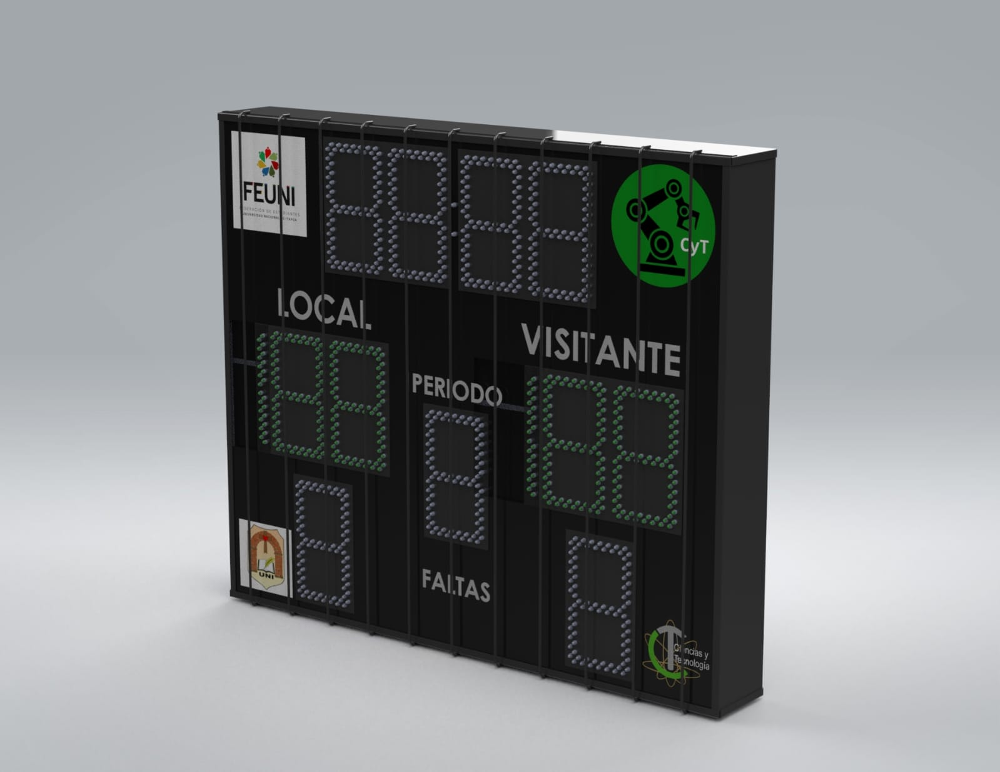
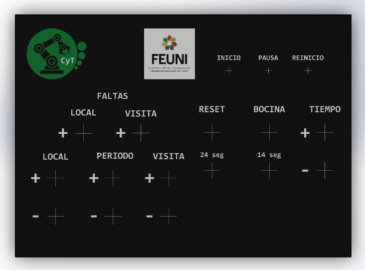

# Proyecto de Tablero Electrónico 

Este proyecto consiste en el desarrollo de un tablero electrónico, utilizando microcontroladores para la recepción, transmisión y procesamiento de datos.

## Descripción del Proyecto

El sistema está compuesto por una consola de control sentral que transmite las ordenes a los tableros. La comunicación entre estos dispositivos se realiza mediante el protocolo de comunicación inalámbrica ESP-NOW.

### Componentes Principales

1. **Tablero Principal:**
   - **ESP8266:** Encargado de recibir datos.
   - **ATmega2560:** Responsable de la comunicación de cada display del tablero y del cronómetro.
   - **74hc595:** Encargado de recibir el registro de desplazamiento para cada digito del tablero
   - **ULN2002:** Serie Transistores encargado de alimentar cada segmento del display
    
2. **Consola de control :**
   - **ESP32:** Utilizado para transmitir las órdenes a los respectivos tableros.
   - **Armazón:** Pieza impresa en 3d para almacenar los componentes electronicos y facilitar su uso
   - **Botones pulsadores:** Varios botones conectados en high pulse
3. **Cronómetros de Baloncesto:**
   - **ESP8266:** En cada cronómetro para la transmisión de datos.
   - **74hc595:** Encargado de recibir el registro de desplazamiento para cada digito del tablero
   - **ULN2002:** Serie Transistores encargado de alimentar cada segmento del display

### Protocolo de Comunicación

- **ESP-NOW Wireless Communication Protocol:** Utilizado para la transmisión de datos entre los microcontroladores de manera eficiente y rápida.

### Imagen del Tablero Principal:

### Imagen de la Consola de control:

